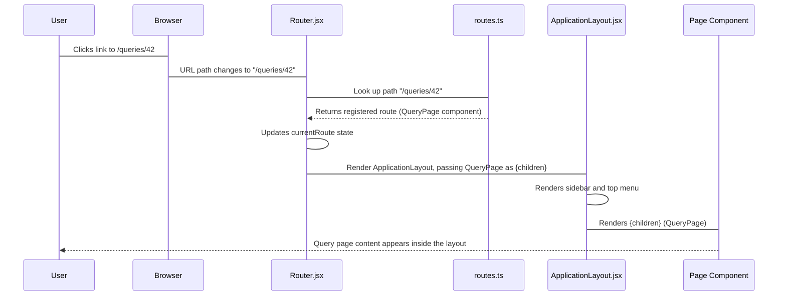

# Chapter 1: Frontend Router and Layout

Welcome to the Redash codebase! Since Redash is a modern web application, most of the user interface you interact with—like creating dashboards, viewing queries, and navigating settings—is built using React. This chapter explains the two foundational concepts that make this experience possible: the **Frontend Router** (which handles navigation) and the **Application Layout** (which provides a consistent look and feel).

## 1. What Problem Are We Solving?

Imagine Redash as a huge library. When you type a specific address (a URL) into your browser, you want to be taken immediately to the correct book or section.

In a traditional website, changing the URL usually means the browser fetches a brand new HTML page from the server. Redash, however, is a Single Page Application (SPA). This means it loads a single HTML file initially, and then React handles all subsequent navigation internally without refreshing the whole page.

The **Router** is the system that listens to URL changes and figures out *which* React component (page) to display, making the navigation feel fast and seamless.

The **Layout** is the wrapper that ensures every page—whether you are viewing a Query or a Dashboard—has the same essential structure, like the persistent sidebar menu and the top navigation bar.

Our goal in this chapter is to understand how Redash handles these transitions and keeps the UI consistent.

## 2. The Frontend Router: The Navigation Brain

The Router's job is simple: **Map a URL path to a corresponding React page component.**

Redash uses a library called `universal-router` to manage this process.

### 2.1 Router Components (`client/app/components/ApplicationArea/Router.jsx`)

The central component for routing is the `Router`.

```jsx
// client/app/components/ApplicationArea/Router.jsx (Simplified)
export default function Router({ routes, onRouteChange }) {
  const [currentRoute, setCurrentRoute] = useState(null);
  
  // 1. Setup UniversalRouter when component mounts
  useEffect(() => {
    const router = new UniversalRouter(routes, { /* ... options */ });
    
    // 2. Start listening for URL changes
    function resolve(action) {
      const pathname = stripBase(location.path) || "/";
      
      router.resolve({ pathname })
        .then(route => {
          // 3. Update state with the new route details
          setCurrentRoute({ ...route, key: generateRouteKey() });
        })
        .catch(error => { /* Handle 404/error */ });
    }
    
    // Listen for history changes (browser back/forward buttons, links)
    const unlisten = location.listen((unused, action) => resolve(action));

    resolve("PUSH"); // Initial load
    return () => { unlisten(); }; // Cleanup
  }, [routes]);

  if (!currentRoute) {
    return null; // Show nothing until the route is determined
  }

  // 4. Render the component specified by the route
  return (
    <CurrentRouteContext.Provider value={currentRoute}>
      <ErrorBoundary>
        {currentRoute.render(currentRoute)} 
      </ErrorBoundary>
    </CurrentRouteContext.Provider>
  );
}
```

The key steps the `Router` performs are:

| Step | Action |
| :--- | :--- |
| 1 | Defines a map of available `routes` (paths like `/queries` and `/dashboards`). |
| 2 | On initial load or URL change, it checks the path (`location.path`). |
| 3 | It uses `universal-router` to match the path to a configured route object. |
| 4 | Once matched, it calls the `render` function defined in that route object, which returns the page component to display. |

### 2.2 Registering Routes (`client/app/services/routes.ts`)

Where do these `routes` come from? They are registered globally using the `routes` service.

```typescript
// client/app/services/routes.ts (Simplified)
class Routes {
  _items: RouteItem[] = [];

  get items(): RouteItem[] {
    // Returns routes, sorted so that specific paths match before general ones
    return this._items; 
  }

  public register<P>(id: string, route: RedashRoute<P>) {
    // Add a new route definition to the list
    this._items = [...this.items, { ...route, id }];
    this._sorted = false;
  }
  // ... unregister logic ...
}

export default new Routes();
```

Any part of Redash (including extensions or plugins) can call `routes.register()` to add a new path, making the routing highly flexible.

For example, to register a path for viewing a query:

```javascript
// Example of how a page registers itself
import routeWithUserSession from "@/components/ApplicationArea/routeWithUserSession";
import QueryPage from "@/pages/queries/QueryPage";
import routes from "@/services/routes";

// Define the route for viewing a specific query by its ID
routes.register(
  "Queries.View",
  routeWithUserSession({
    path: "/queries/:queryId",
    title: "View Query",
    render: props => <QueryPage {...props} />,
  })
);
```

When a user navigates to `/queries/123`, the Router matches this path, finds the `QueryPage` component, and prepares to render it.

## 3. The Application Layout: Consistent Structure

While the Router decides *what* content to show, the **Layout** decides *where* that content is placed within the overall application shell.

In Redash, most pages are wrapped by the `ApplicationLayout` component, ensuring the sidebar and top menus are always visible.

### 3.1 Applying the Layout (`client/app/components/ApplicationArea/routeWithUserSession.tsx`)

Redash uses a wrapper function, `routeWithUserSession`, to ensure every primary page component (like the Query page or Dashboard page) is:

1. Protected (the user must be logged in). (We will discuss this in [User, Authentication, and Permissions](02_user__authentication__and_permissions_.md)).
2. Wrapped inside the `ApplicationLayout`.

```tsx
// client/app/components/ApplicationArea/routeWithUserSession.tsx (Simplified)
// This function takes a page component definition and wraps it.
export function UserSessionWrapper({ currentRoute, render }: UserSessionWrapperProps<P>) {
  
  // Checks authentication status here (omitted for simplicity)
  const isAuthenticated = true; 

  if (!isAuthenticated) {
    return null; // Don't render content if user isn't logged in
  }

  return (
    // STEP 1: Apply the main application layout
    <ApplicationLayout>
      {/* STEP 2: Render the actual page content inside the layout */}
      <React.Fragment key={currentRoute.key}>
        <ErrorBoundary>
          {/* Call the original render function, e.g., <QueryPage /> */}
          {render({ ...currentRoute.routeParams, pageTitle: currentRoute.title, onError: handleError })}
        </ErrorBoundary>
      </React.Fragment>
    </ApplicationLayout>
  );
}
```

### 3.2 Defining the Layout (`client/app/components/ApplicationArea/ApplicationLayout/index.jsx`)

The `ApplicationLayout` defines the rigid structure of the Redash UI.

```jsx
// client/app/components/ApplicationArea/ApplicationLayout/index.jsx (Simplified)
import DesktopNavbar from "./DesktopNavbar";
// ... imports ...

export default function ApplicationLayout({ children }) {
  return (
    <React.Fragment>
      <div className="application-layout-side-menu">
        {/* The persistent left sidebar menu */}
        <DesktopNavbar />
      </div>
      
      <div className="application-layout-content">
        <nav className="application-layout-top-menu">
          {/* The top navigation bar (for mobile/contextual actions) */}
          <MobileNavbar />
        </nav>
        
        {/* THIS is where the route content (the 'children') is rendered! */}
        {children}
      </div>
    </React.Fragment>
  );
}
```

The `children` prop here is the page component (like `QueryPage`) that the Router determined should be displayed. By wrapping the content this way, the sidebar and top navigation are persistent elements that don't reload when you switch pages.

## 4. Sequence of Events: Navigation

Let's trace what happens when a user clicks a link to navigate from a Dashboard page to a Query page in Redash.



This whole process happens without a full page refresh, making the application feel responsive and fast.

## Conclusion

The Frontend Router and Layout are the foundations of the Redash user experience. The **Router** (`Router.jsx`) acts as the map, matching URLs to specific pages registered via the `routes` service. The **Layout** (`ApplicationLayout.jsx`) acts as the frame, ensuring that regardless of which page the Router selects, the consistent application shell (menus, navigation bars) remains in place.

With the navigation structure understood, we can now look at how Redash manages who can access these pages and what they can do.

[Next Chapter: User, Authentication, and Permissions](02_user__authentication__and_permissions_.md)

---

<sub><sup>Generated by [AI Codebase Knowledge Builder](https://github.com/The-Pocket/Tutorial-Codebase-Knowledge).</sup></sub> <sub><sup>**References**: [[1]](https://github.com/getredash/redash/blob/bc0add410d61430a1a43a21abf2454a493c0b046/client/app/components/ApplicationArea/ApplicationLayout/index.jsx), [[2]](https://github.com/getredash/redash/blob/bc0add410d61430a1a43a21abf2454a493c0b046/client/app/components/ApplicationArea/Router.jsx), [[3]](https://github.com/getredash/redash/blob/bc0add410d61430a1a43a21abf2454a493c0b046/client/app/components/ApplicationArea/index.jsx), [[4]](https://github.com/getredash/redash/blob/bc0add410d61430a1a43a21abf2454a493c0b046/client/app/components/ApplicationArea/routeWithUserSession.tsx), [[5]](https://github.com/getredash/redash/blob/bc0add410d61430a1a43a21abf2454a493c0b046/client/app/services/routes.ts)</sup></sub>
