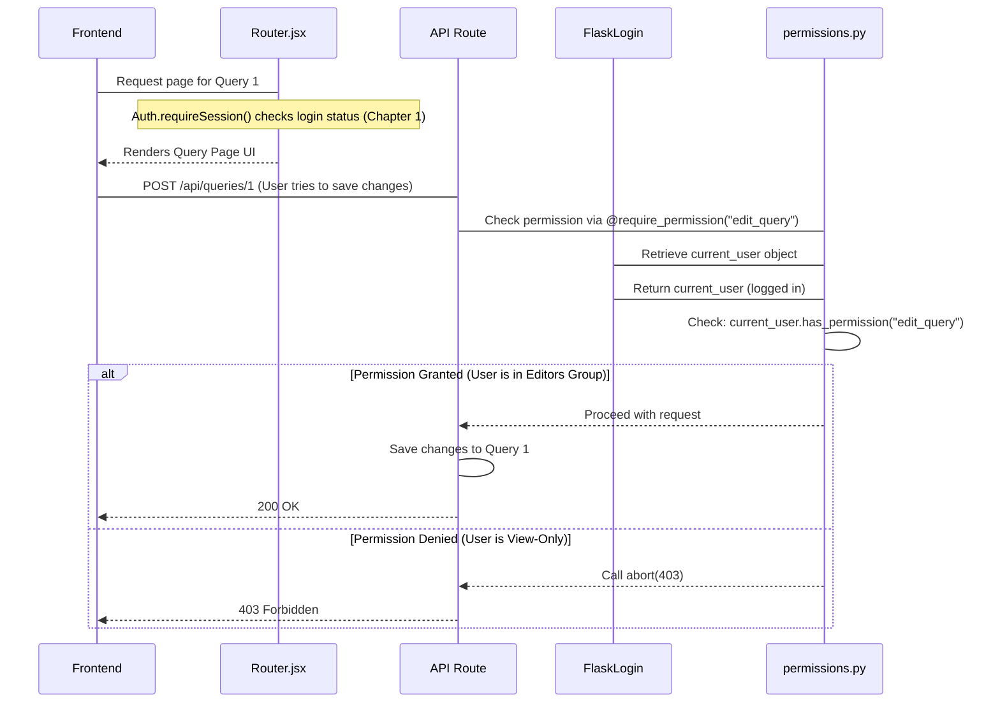

# Chapter 2: User, Authentication, and Permissions

[Previous Chapter: Frontend Router and Layout](01_frontend_router_and_layout_.md)

# Chapter 2: User, Authentication, and Permissions

In [Chapter 1: Frontend Router and Layout](01_frontend_router_and_layout_.md), we learned how Redash determines *where* to display content (the layout) and *how* to navigate between pages (the router). But before the Router can even decide to render a page, Redash must answer a critical question: **Who are you, and are you allowed to see this?**

This is the role of the User, Authentication, and Permissions system. This structure is essential for security, ensuring that only administrators can access settings, and regular users can only view or modify the queries and dashboards they are authorized for.

## 1. The Core Problem: Who Gets In?

Imagine Redash is a private data warehouse. You don't want unauthorized people viewing sensitive company data or, worse, deleting important queries.

This system solves three distinct problems:

| Concept | Question | Redash Component | Analogy |
| :--- | :--- | :--- | :--- |
| **User** | Who are you? | `redash/models/users.py` | Your identity (Name, ID). |
| **Authentication** | Can you prove you are you? | `redash/authentication/__init__.py`, Flask-Login | Showing your ID at the door. |
| **Permissions** | What are you allowed to do here? | `redash/permissions.py`, `redash/models/users.py` (Groups) | Checking the VIP list or staff access badges. |

We will start by looking at the core identity element: the `User`.

## 2. Defining Identity: The User Model

The `User` model, defined in `redash/models/users.py`, is the central source of truth for every identity in Redash. It stores basic information, but most importantly, it links the user to their access rights via **Groups**.

### 2.1 The User Class (`redash/models/users.py`)

The Redash `User` inherits from `Flask-Login`'s `UserMixin` on the backend, which gives it basic capabilities needed for session management.

```python
# redash/models/users.py (Simplified)
class User(TimestampMixin, db.Model, UserMixin, PermissionsCheckMixin):
    id = primary_key("User")
    name = Column(db.String(320))
    email = Column(EmailType)
    password_hash = Column(db.String(128), nullable=True)
    
    # Crucial link for permissions: an array of Group IDs
    group_ids = Column(
        "groups",
        MutableList.as_mutable(ARRAY(key_type("Group"))),
        nullable=True,
    )
    # ... other details like API key, disabled status ...

    def verify_password(self, password):
        # Method to check password hash against supplied password
        return self.password_hash and pwd_context.verify(password, self.password_hash)
```

Notice the `group_ids` column. A user belongs to one or more groups, and these groups determine the user's permissions.

## 3. Authentication: Proving Who You Are

Authentication ensures the person interacting with Redash is the person they claim to be. Redash supports multiple authentication methods (password login, Google OAuth, SAML, API keys). All of these ultimately rely on the Flask-Login library on the backend to manage the user session.

### 3.1 Backend Session Loading (`redash/authentication/__init__.py`)

When a user accesses an authenticated page, Flask-Login intercepts the request and checks the session cookie. It uses the `load_user` function to retrieve the correct `User` object from the database.

```python
# redash/authentication/__init__.py (Simplified)
from flask_login import LoginManager

login_manager = LoginManager()

@login_manager.user_loader
def load_user(user_id_with_identity):
    # Flask-Login calls this function using the ID stored in the session cookie.
    try:
        user_id, _ = user_id_with_identity.split("-")
        user = models.User.get_by_id_and_org(user_id, current_org)
        
        if user.is_disabled:
            return None
        return user
    except models.NoResultFound:
        return None
```

If `load_user` returns a `User` object, the user is considered authenticated, and the user object is available globally as `current_user` for the rest of the request lifecycle.

### 3.2 Frontend Enforcement (`client/app/services/auth.js`)

On the frontend, Redash ensures that application components only load if a session is active. This happens in the `Auth` service.

```javascript
// client/app/services/auth.js (Simplified)
export const Auth = {
  // ... isAuthenticated() definition ...

  requireSession() {
    // Check if we already have a session loaded locally
    if (Auth.isAuthenticated()) {
      return Promise.resolve(session);
    }
    
    // Attempt to retrieve session from the backend
    return Auth.loadSession()
      .then(() => {
        if (!Auth.isAuthenticated()) {
          // If loading fails (i.e., backend said 'no session'), redirect
          Auth.login(); 
        }
      })
      .catch(() => {
        Auth.login(); // Force redirect to login page
      });
  },
};
```

This `requireSession()` function is explicitly called by the wrapper (`routeWithUserSession`) that we saw in Chapter 1. If the session requirement fails, the user is immediately redirected to the login page (`/login`).

## 4. Permissions: What You Are Allowed to Do

Authentication proves identity. Permissions (or Authorization) determine capability. In Redash, permissions are managed through **Groups** (defined in `redash/models/users.py`).

### 4.1 Groups and Capabilities

Groups hold a list of string-based permissions.

```python
# redash/models/users.py (Group model excerpt)
class Group(db.Model, BelongsToOrgMixin):
    DEFAULT_PERMISSIONS = [
        "create_dashboard",
        "view_query",
        "execute_query",
        # ... many others
    ]

    id = primary_key("Group")
    name = Column(db.String(100))
    # This array defines what actions members of this group can perform
    permissions = Column(ARRAY(db.String(255)), default=DEFAULT_PERMISSIONS)
```

The `User` object aggregates all permissions from all the groups they belong to via the `User.permissions` property.

### 4.2 Enforcing Permissions (`redash/permissions.py`)

The most critical part of the permission system is how Redash enforces these rules on the backend (the API layer). This is handled by decorators defined in `redash/permissions.py`.

When you define an API endpoint (e.g., creating a new data source), you protect it using the `@require_permission` decorator.

```python
# redash/permissions.py (Simplified decorator)
def require_permission(permission):
    def decorator(fn):
        @functools.wraps(fn)
        def decorated(*args, **kwargs):
            # Check if the currently logged-in user has the required permission string
            if current_user.has_permission(permission):
                return fn(*args, **kwargs)
            else:
                # If not authorized, stop the request and return 403 Forbidden
                abort(403) 
        return decorated
    return decorator

# Example of protecting an API endpoint:
# @routes.route('/api/data_sources', methods=['POST'])
# @require_permission("create_data_source") 
# def create_new_data_source():
#     # ... code to create the data source runs only if permission is granted
```

If `current_user` lacks the required permission (e.g., "admin"), the function inside the API route never executes, and the user receives a 403 error.

## 5. Sequence of Events: Protecting a Query

Let's trace how the full security system works when a user tries to access the API to update a Query.



### Advanced Access: Data Source Permissions

In addition to group-level permissions like `create_query`, Redash also handles specific object permissions. For instance, a user might be generally allowed to execute queries, but they might be restricted from using a highly sensitive [Data Source](03_data_source_and_query_runner_.md).

This level of detail is often managed by relationship tables that link users/groups directly to specific data sources, ensuring granular control over the data being queried.

## Conclusion

The security layer in Redash is built on a layered approach:

1. **Identity:** The `User` model defines who is logging in, linking them to specific access rights through `group_ids`.
2. **Authentication:** Backend mechanisms like Flask-Login (`redash/authentication/__init__.py`) verify the user's identity based on various login methods and maintain the session.
3. **Permissions (Authorization):** Decorators in `redash/permissions.py` check the user's aggregated group permissions (`User.permissions`) against the required action (e.g., "admin," "create_query"), preventing unauthorized API calls and ensuring only appropriate functions run.

This system guarantees that every action, from viewing a dashboard to editing settings, is authorized by a verified user.

Now that we understand who is accessing the system and what they are allowed to do, we can dive into the objects they interact with: the data itself.

[Next Chapter: Data Source and Query Runner](03_data_source_and_query_runner_.md)

---

<sub><sup>Generated by [AI Codebase Knowledge Builder](https://github.com/The-Pocket/Tutorial-Codebase-Knowledge).</sup></sub> <sub><sup>**References**: [[1]](https://github.com/getredash/redash/blob/bc0add410d61430a1a43a21abf2454a493c0b046/client/app/services/auth.js), [[2]](https://github.com/getredash/redash/blob/bc0add410d61430a1a43a21abf2454a493c0b046/client/app/services/policy/index.js), [[3]](https://github.com/getredash/redash/blob/bc0add410d61430a1a43a21abf2454a493c0b046/redash/authentication/__init__.py), [[4]](https://github.com/getredash/redash/blob/bc0add410d61430a1a43a21abf2454a493c0b046/redash/models/users.py), [[5]](https://github.com/getredash/redash/blob/bc0add410d61430a1a43a21abf2454a493c0b046/redash/permissions.py)</sup></sub>
