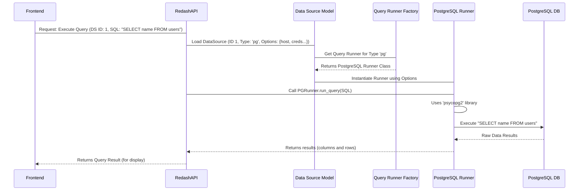

# Chapter 3: Data Source and Query Runner

In [Chapter 2: User, Authentication, and Permissions](02_user__authentication__and_permissions_.md), we established *who* is accessing Redash and *what* they are allowed to do. Now we need to figure out how Redash gets the data that users want to analyze.

Redash is designed to be database-agnostic—it doesn't care if your data lives in a cloud data warehouse like Snowflake, a relational database like PostgreSQL, or even a simple Google Sheet. To handle this huge variety, Redash uses two core abstractions that work together: the **Data Source** and the **Query Runner**.

## 1. The Core Problem: Talking to Databases

Imagine Redash needs to speak two completely different languages: PostgreSQL (a SQL dialect) and Amazon Athena (which uses cloud APIs).

If Redash had to handle all the connection details, security protocols, and specific execution methods for every database type directly, the core Redash application code would become messy and hard to maintain.

The solution is specialization:

1. **Data Source:** Stores the *generic* information (credentials, host).
2. **Query Runner:** Provides the *specific* code implementation needed to interact with that database type.

---

## 2. Data Source: The Connection Blueprint

A **Data Source** is a record stored in the Redash database (`redash/models/__init__.py: DataSource`). It holds all the necessary, yet generic, information needed to connect to an external data system.

### 2.1 The Data Source Model

The `DataSource` model handles three critical pieces of information:

| Component | Description | Example |
| :--- | :--- | :--- |
| `name` | The human-readable label (e.g., "Production PostgreSQL"). | |
| `type` | The internal identifier defining the database driver needed (e.g., 'pg', 'redshift', 'athena'). | |
| `options` | The actual connection details (host, username, password, API keys). **This field is encrypted.** | |

Here is a simplified view of the `DataSource` model definition:

```python
# redash/models/__init__.py (DataSource Simplified)
class DataSource(BelongsToOrgMixin, db.Model):
    id = primary_key("DataSource")
    name = Column(db.String(255))
    type = Column(db.String(255))
    
    # Stores host, user, password. This field is automatically encrypted 
    # using EncryptedConfiguration for security.
    options = Column("encrypted_options", ConfigurationContainer.as_mutable(
        EncryptedConfiguration(db.Text, settings.DATASOURCE_SECRET_KEY, FernetEngine)
    ))
    
    @property
    def query_runner(self):
        # The crucial link: dynamically loads the correct Query Runner based on 'type'.
        return get_query_runner(self.type, self.options)
```

The Data Source itself is just a passive container for configuration. Its most important job is providing the `query_runner` property, which dynamically locates the specialized Query Runner code required for execution.

## 3. Query Runner: The Specialized Driver

The **Query Runner** is the Python class responsible for executing the user's SQL or API calls against the external database defined in the Data Source.

You can think of a Query Runner as a database driver or adapter. It contains the specific logic—like importing Python client libraries (e.g., `psycopg2` for PostgreSQL) and implementing the connection protocol—that a certain database requires.

### 3.1 Base Query Runner (`redash/query_runner/__init__.py`)

All Query Runners in Redash inherit from the abstract `BaseQueryRunner`. This ensures every database driver adheres to the same contract: they must be able to initialize with configuration, test the connection, and run a query.

```python
# redash/query_runner/__init__.py (BaseQueryRunner Simplified)
class BaseQueryRunner:
    
    def __init__(self, configuration):
        # Receives the decrypted options from the Data Source
        self.configuration = configuration 

    @classmethod
    def type(cls):
        # Used for registration (e.g., returns 'pg')
        return cls.__name__.lower()

    def test_connection(self):
        # Must connect and run a simple NOOP query (e.g., SELECT 1)
        raise NotImplementedError()

    def run_query(self, query, user):
        # The primary execution method: Connects, executes the query, 
        # and returns the raw data results (rows and columns).
        raise NotImplementedError()
```

### 3.2 Registration and Specific Implementations

When Redash starts up, it finds all the specific Query Runner classes (like `PostgreSQL` or `Redshift`) and uses the `@register` decorator to add them to a global dictionary (`query_runners`).

```python
# redash/query_runner/pg.py (PostgreSQL Runner Example)
import psycopg2 
from redash.query_runner import register, BaseSQLQueryRunner

@register
class PostgreSQL(BaseSQLQueryRunner):
    @classmethod
    def type(cls):
        return "pg"
        
    def _get_connection(self):
        # Uses standard Python library (psycopg2) and the configuration 
        # stored in self.configuration (which came from the DataSource options)
        connection = psycopg2.connect(
            user=self.configuration.get("user"),
            host=self.configuration.get("host"),
            # ... password, dbname, etc.
        )
        return connection
        
    # ... implementation for run_query, which uses the connection ...
```

This registration is key: when the `DataSource` asks for the 'pg' runner type, the system looks up the registered `PostgreSQL` class and instantiates it with the connection details.

## 4. Sequence of Events: Running a Query

Let's trace the flow when a user clicks the "Execute" button for a new query aimed at a PostgreSQL Data Source.

### 4.1 The High-Level Flow

The system must translate the user's intent ("run SQL X against Data Source Y") into actual database commands.



### 4.2 Key Interactions

1. **Request:** The API endpoint receives the query request. (In [Chapter 4: Query and QueryResult](04_query_and_queryresult_.md), we will see this request triggers an asynchronous task.)
2. **Loading:** Redash loads the `DataSource` object from the database using the provided ID.
3. **Instantiation:** Redash accesses the `DataSource.query_runner` property. This function calls `get_query_runner` (the factory function in `redash/query_runner/__init__.py`) using the `type` field (`pg`) and the decrypted `options`.
4. **Execution:** The instantiated `PostgreSQL` runner object now holds all the necessary configuration. It uses its internal logic (like the `_get_connection` method) to connect to the external database, execute the SQL, and format the raw result data into the JSON structure Redash expects (list of column definitions and list of row objects).

This clear separation ensures that adding a completely new database type (say, Firebolt) only requires creating a new Python class that adheres to the `BaseQueryRunner` contract, without modifying any core Redash execution logic.

## Conclusion

The Data Source and Query Runner form the vital translation layer of Redash.

* The **Data Source** (`redash/models/DataSource`) is the durable, encrypted record of *what* we are connecting to.
* The **Query Runner** (`redash/query_runner/pg.py`, etc.) is the ephemeral, executable code that knows *how* to translate the user's request into commands specific to that database and return the results.

This powerful abstraction allows Redash to speak to dozens of different data systems seamlessly. Now that we understand how the connection is made, we can look at the data objects created during this process.

[Next Chapter: Query and QueryResult](04_query_and_queryresult_.md)

---

<sub><sup>Generated by [AI Codebase Knowledge Builder](https://github.com/The-Pocket/Tutorial-Codebase-Knowledge).</sup></sub> <sub><sup>**References**: [[1]](https://github.com/getredash/redash/blob/bc0add410d61430a1a43a21abf2454a493c0b046/client/app/services/data-source.js), [[2]](https://github.com/getredash/redash/blob/bc0add410d61430a1a43a21abf2454a493c0b046/redash/handlers/data_sources.py), [[3]](https://github.com/getredash/redash/blob/bc0add410d61430a1a43a21abf2454a493c0b046/redash/models/__init__.py), [[4]](https://github.com/getredash/redash/blob/bc0add410d61430a1a43a21abf2454a493c0b046/redash/query_runner/__init__.py), [[5]](https://github.com/getredash/redash/blob/bc0add410d61430a1a43a21abf2454a493c0b046/redash/query_runner/pg.py)</sup></sub>
