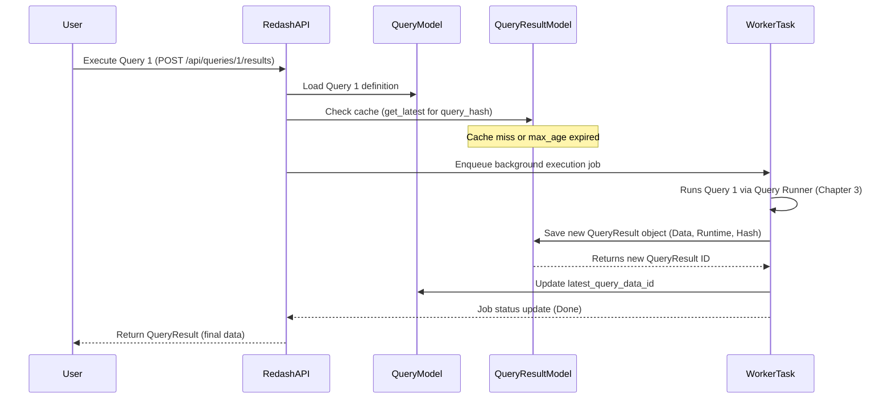

# Chapter 4: Query and QueryResult

[Previous Chapter: Data Source and Query Runner](03_data_source_and_query_runner_.md)

In [Chapter 3: Data Source and Query Runner](03_data_source_and_query_runner_.md), we learned how Redash talks to external databases. Now that we know *how* to connect, we need a way to store the user's request for data and the actual data that comes back.

This is the job of the two most fundamental data objects in Redash: **Query** and **QueryResult**.

## 1. The Core Problem: Separating Intent from Output

Imagine you run a complex SQL query that takes 10 minutes to finish. You want to save that query so you can run it again tomorrow, share it with a colleague, and use the results in a dashboard.

Redash needs to store two very different things:

1. **The Recipe (The Query):** The instructions—the SQL code, which database to use, and how often to run it (the schedule). This is persistent.
2. **The Produced Dish (The QueryResult):** The actual table of data (the output), which is large, time-sensitive, and cached.

The `Query` model stores the *intent* (the recipe), and the `QueryResult` model stores the *outcome* (the dish).

## 2. The Query Model: The Persistent Recipe

The `Query` object is the core model that users interact with directly. When you click "Save" in the Redash editor, you are saving a `Query` object into the Redash PostgreSQL database.

This object holds everything necessary to repeat the data retrieval process reliably.

### 2.1 Key Components of a Query (Backend)

The `Query` model (`redash/models/__init__.py`) is designed for persistence and metadata tracking.

| Field | Description | Role |
| :--- | :--- | :--- |
| `query_text` | The actual SQL or API code the user wrote. | The core instruction set. |
| `data_source_id` | Foreign key linking it to a specific [Data Source](03_data_source_and_query_runner_.md). | Where to run the recipe. |
| `schedule` | Contains JSON defining the refresh interval (e.g., run every 5 minutes). | When to run the recipe automatically. |
| `latest_query_data_id`| **Crucial Link:** The ID of the most recent valid `QueryResult` generated by this query. | Points to the freshest dish. |
| `query_hash` | A unique cryptographic hash generated from the `query_text`. | Used for highly efficient cache lookups. |

### 2.2 Simplified Query Model Code

The Python model highlights these links and fields:

```python
# redash/models/__init__.py (Query Simplified)
class Query(TimestampMixin, db.Model):
    id = primary_key("Query")
    data_source_id = Column(key_type("DataSource"))
    query_text = Column("query", db.Text) 
    
    # Hash derived from the query_text (used for caching!)
    query_hash = Column(db.String(32)) 
    
    # Link to the latest result object
    latest_query_data_id = Column(key_type("QueryResult"), nullable=True) 
    schedule = Column(JSONB, nullable=True)
    # ... other fields (user_id, name, is_draft, tags) ...
```

Notice the `latest_query_data_id`. The `Query` object doesn't contain the result data itself; it just knows *where* the result is stored.

## 3. The QueryResult Model: The Cached Output

The `QueryResult` object (`redash/models/__init__.py`) is where the actual output from the database lives. These objects are often very large (many rows, many columns) and are saved separately, typically in a cache storage (like Redis or the Redash database itself, depending on size/configuration).

### 3.1 Key Components of a QueryResult (Backend)

The `QueryResult` is the raw, structured data payload along with metadata about the execution.

| Field | Description | Role |
| :--- | :--- | :--- |
| `data` | A JSON structure holding the column definitions and the row values. | The actual data table. |
| `runtime` | How long, in seconds, the [Query Runner](03_data_source_and_query_runner_.md) took to execute the query. | Performance metric. |
| `retrieved_at` | The exact time this result was generated. | Used for cache freshness checks. |
| `query_hash` | Matches the hash from the parent `Query` or ad-hoc query. | Key for caching: identical hash means identical query. |

### 3.2 Simplified QueryResult Model Code

```python
# redash/models/__init__.py (QueryResult Simplified)
class QueryResult(db.Model):
    id = primary_key("QueryResult")
    data_source_id = Column(key_type("DataSource"))
    query_hash = Column(db.String(32), index=True)
    
    # The actual result set (columns and rows) stored as JSON
    data = Column(JSONText, nullable=True) 
    
    runtime = Column(DOUBLE_PRECISION)
    retrieved_at = Column(db.DateTime(True)) 
    # ... other fields ...
```

## 4. How Query and QueryResult Work Together

When a user executes a query, Redash performs three critical checks, all centered around the `query_hash`:

1. **Generate Hash:** Calculate the hash of the query text (and parameters, if any).
2. **Check Cache:** Look up the `QueryResult` table using the calculated `query_hash`. Is there a result that is still "fresh" (i.e., less than the required `max_age`)?
3. **Execute or Use Cache:**
    * **Cache Hit:** If yes, return the existing `QueryResult` immediately.
    * **Cache Miss:** If no, queue a new background task to execute the query.

### 4.1 Sequence of Events: Query Execution

This diagram shows the flow for a saved query that needs fresh data (Cache Miss).



This asynchronous process (using the `WorkerTask`) is crucial for Redash, as it allows the user's browser session to remain responsive while long queries run in the background. We will explore this mechanism in detail in [RQ (Redis Queue) Tasks](06_rq__redis_queue__tasks_.md).

### 4.2 Frontend Abstraction

On the client side, Redash uses a JavaScript wrapper class called `QueryResult` (`client/app/services/query-result.js`) to handle the asynchronous nature of execution.

Since executing a query starts a *job* (which runs in the background), the frontend object needs to represent the *state* of that job, not just the final data.

```javascript
// client/app/services/query-result.js (Simplified)
export const ExecutionStatus = {
  WAITING: "waiting",
  PROCESSING: "processing",
  DONE: "done",
  FAILED: "failed",
  // ...
};

class QueryResult {
  constructor(props) {
    this.job = {}; // Used if execution is PROCESSING
    this.query_result = {}; // Used if execution is DONE
    this.status = "waiting";

    if (props) {
      this.update(props);
    }
  }

  getStatus() {
    return this.status || statuses[this.job.status];
  }
  
  // Checks the job status periodically until complete
  refreshStatus(query, parameters, tryNumber = 1) { /* ... poll API ... */ } 

  update(props) {
    extend(this, props);
    if ("query_result" in props) {
      this.status = ExecutionStatus.DONE;
      // Data is now loaded and ready for visualization
      // ...
    } else if (this.job.status === 4) {
      this.status = ExecutionStatus.FAILED;
    }
  }
}
```

This frontend `QueryResult` object abstracts away the polling process (`refreshStatus`), allowing React components (from [Chapter 1: Frontend Router and Layout](01_frontend_router_and_layout_.md)) to simply watch the object's status until it transitions to `DONE`.

## Conclusion

The distinction between `Query` and `QueryResult` is vital for Redash’s scalability and performance:

* The **Query** is the small, persistent, shared *recipe* (SQL, schedule, hash), pointing to the latest data via `latest_query_data_id`.
* The **QueryResult** is the large, ephemeral, and frequently refreshed *data output* (rows, columns, runtime).

This separation allows Redash to manage execution time, cache results effectively, and keep the application responsive. However, SQL alone isn't flexible enough for dynamic reporting. In the next chapter, we will look at how Redash enhances the `Query` model with runtime inputs.

[Next Chapter: Query Parameters](05_query_parameters_.md)

---

<sub><sup>Generated by [AI Codebase Knowledge Builder](https://github.com/The-Pocket/Tutorial-Codebase-Knowledge).</sup></sub> <sub><sup>**References**: [[1]](https://github.com/getredash/redash/blob/bc0add410d61430a1a43a21abf2454a493c0b046/client/app/services/query-result.js), [[2]](https://github.com/getredash/redash/blob/bc0add410d61430a1a43a21abf2454a493c0b046/client/app/services/query.js), [[3]](https://github.com/getredash/redash/blob/bc0add410d61430a1a43a21abf2454a493c0b046/redash/handlers/queries.py), [[4]](https://github.com/getredash/redash/blob/bc0add410d61430a1a43a21abf2454a493c0b046/redash/handlers/query_results.py), [[5]](https://github.com/getredash/redash/blob/bc0add410d61430a1a43a21abf2454a493c0b046/redash/models/__init__.py), [[6]](https://github.com/getredash/redash/blob/bc0add410d61430a1a43a21abf2454a493c0b046/redash/models/parameterized_query.py)</sup></sub>
