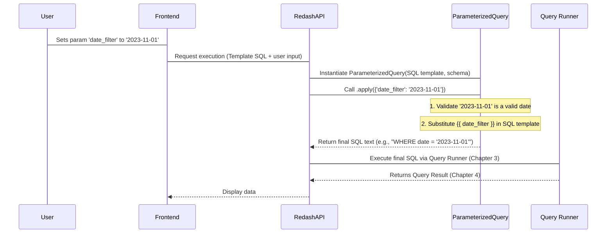

# Chapter 5: Query Parameters

[Previous Chapter: Query and QueryResult](04_query_and_queryresult_.md)

In [Chapter 4: Query and QueryResult](04_query_and_queryresult_.md), we learned how Redash stores a query (the recipe) and its result (the output data). However, a standard SQL query is static: it runs the exact same code every time.

In the real world, dashboards and reports need to be dynamic. Users need to filter data by date range, specific customers, or region—all without editing the original SQL.

This is the purpose of **Query Parameters**. Parameters allow users to inject dynamic values into a query template, transforming a static query into an interactive report.

---

## 1. The Core Problem: Making Queries Interactive

Imagine you have a saved query that shows daily signups. Every morning, you have to manually change the `WHERE` clause:

**Static Query:**

```sql
SELECT count(*) FROM users
WHERE signup_date = '2023-10-26' -- Must change this daily!
```

If 10 different users want to check 10 different days, you would need 10 different saved queries. This is inefficient.

**The Solution: Parameterization**

Parameters act as placeholders in the SQL template. Redash handles gathering the user input and safely replacing the placeholder with the chosen value before execution.

**Parameterized Query:**

```sql
SELECT count(*) FROM users
WHERE signup_date = '{{ selected_date }}'
```

When a user views this query, Redash automatically displays an input box for `selected_date`.

## 2. Parameter Syntax and Frontend Setup

Parameters are identified in Redash using the Mustache templating syntax: double curly braces around the parameter's name: `{{ parameter_name }}`.

### 2.1 The Parameter Object (Frontend)

On the frontend, Redash relies on the `Parameter` object (`client/app/services/parameters/Parameter.js`). This is a generic class that tracks the parameter's definition and its current value.

The core functionality of the frontend parameter object is simple:

```javascript
// client/app/services/parameters/Parameter.js (Simplified)
class Parameter {
  constructor(parameter, parentQueryId) {
    this.title = parameter.title; // Display name
    this.name = parameter.name;   // The keyword used in {{...}}
    this.type = parameter.type;   // e.g., 'text', 'date', 'enum'
    this.value = null;            // The current user input
  }

  toUrlParams() {
    // Used to save the parameter value in the browser URL
    return {
      [`p_${this.name}`]: this.value,
    };
  }

  getExecutionValue() {
    // Gets the value to be substituted into the query
    return this.value;
  }
}
```

### 2.2 Parameter Types

Redash supports various parameter types, which are specialized classes inheriting from the base `Parameter`. These specializations handle specific input formatting and validation (e.g., ensuring a "number" field only accepts digits, or handling the two values needed for a "date-range").

The factory in `client/app/services/parameters/index.js` determines which specialized class to use:

```javascript
// client/app/services/parameters/index.js (Simplified Factory)
function createParameter(param, parentQueryId) {
  switch (param.type) {
    case "number":
      return new NumberParameter(param, parentQueryId);
    case "enum": // Dropdown list (fixed options)
      return new EnumParameter(param, parentQueryId);
    case "query": // Dropdown list (loaded from another query)
      return new QueryBasedDropdownParameter(param, parentQueryId);
    case "date":
    case "date-range":
      return new DateParameter(param, parentQueryId);
    default:
      return new TextParameter(param, parentQueryId);
  }
}
```

When a user defines a parameter, the frontend determines the type, and the `Parameters` component (`client/app/components/Parameters.jsx`) renders the appropriate input widget (text box, date picker, or dropdown).

## 3. The Backend Magic: Substitution and Validation

When a user enters a value and clicks "Apply" (or "Execute"), Redash must ensure the value is safe, correctly formatted, and substituted into the template before the final SQL is sent to the [Data Source and Query Runner](03_data_source_and_query_runner_.md).

This critical step is managed by the `ParameterizedQuery` class in the backend (`redash/models/parameterized_query.py`).

### 3.1 Step 1: Discovering Parameters

The backend first parses the query text to identify all the used placeholders (`{{...}}`).

```python
# redash/models/parameterized_query.py (Simplified)
def _collect_query_parameters(query):
    # Uses the pystache library to find all keys enclosed in {{...}}
    nodes = pystache.parse(query)
    keys = _collect_key_names(nodes)
    return keys

# Example:
# query = "SELECT id FROM users WHERE region = '{{ region_name }}'"
# _collect_query_parameters(query) -> ['region_name']
```

### 3.2 Step 2: Validation

This is the security and integrity check. If a user sets a `number` parameter type, they shouldn't be able to inject text like `'OR 1=1'`. Redash validates the input against the type definition (which is saved as part of the Query schema).

If validation fails, the query execution is stopped immediately, and the user receives an `InvalidParameterError`.

```python
# redash/models/parameterized_query.py (Simplified validation check)
class ParameterizedQuery:
    # ... init method ...
    
    def _valid(self, name, value):
        # Look up the type definition for this 'name' in the schema
        definition = next(
            (def for def in self.schema if def["name"] == name),
            None,
        )
        
        # Check against predefined rules (e.g., _is_number, _is_date)
        validators = {
            "number": _is_number,
            "date": _is_date,
            "enum": lambda v: _is_value_within_options(v, definition.get("enumOptions")),
            # ... other types ...
        }
        
        validate = validators.get(definition["type"])
        
        try:
            return validate(value)
        except Exception:
            return False
```

### 3.3 Step 3: Substitution

If the input is valid, the `ParameterizedQuery` class uses a `mustache_render` utility to replace the placeholders with the user's provided values, creating the final, runnable SQL text.

```python
# redash/models/parameterized_query.py (Simplified apply method)
class ParameterizedQuery:
    # ...
    def apply(self, parameters):
        # 1. Perform validation checks on all incoming parameters
        # ... validation checks omitted ...
        
        # 2. Update the query text by substituting values
        self.query = mustache_render(
            self.template, 
            join_parameter_list_values(parameters, self.schema)
        )
        return self

# Example substitution:
# Template: "SELECT '{{ value }}'"
# Parameters: {'value': '42'}
# Resulting SQL (self.query): "SELECT '42'"
```

## 4. Sequence of Events: Executing a Parameterized Query

When a user executes a query, the backend process involves an extra layer of pre-processing before execution can proceed.



### Advanced Case: Query-Based Dropdown

One powerful parameter type is the **Query Based Dropdown**. This means the list of valid choices (e.g., a list of all current customer names) is dynamically populated by running *another* Redash query first.

1. **Dependency:** The main query depends on the parameter.
2. **Parameter Dependency:** The parameter depends on a separate "source query."

When the user loads the page, Redash first executes the "source query" to get the list of customer names. This list is then used to populate the dropdown menu. When the user selects a customer, that value is validated against the list generated by the source query before the main query is executed.

This is why Redash needs an execution queue system (which we discuss in the next chapter), as loading a single dashboard might require running several underlying queries just to populate the parameter dropdowns.

## Conclusion

Query Parameters provide the vital link between static data definitions and interactive user reporting.

* Parameters are placeholders in the query template (`{{ name }}`).
* The frontend handles collecting user input and rendering specialized input widgets (date pickers, dropdowns).
* The backend's `ParameterizedQuery` class handles the heavy lifting: **validating** the input against the parameter definition and **substituting** the placeholders with the final values, producing safe, runnable SQL.

This interactivity is often dependent on background execution—a process managed by Redash's task queue system.

[Next Chapter: RQ (Redis Queue) Tasks](06_rq__redis_queue__tasks_.md)

---

<sub><sup>Generated by [AI Codebase Knowledge Builder](https://github.com/The-Pocket/Tutorial-Codebase-Knowledge).</sup></sub> <sub><sup>**References**: [[1]](https://github.com/getredash/redash/blob/bc0add410d61430a1a43a21abf2454a493c0b046/client/app/components/EditParameterSettingsDialog.jsx), [[2]](https://github.com/getredash/redash/blob/bc0add410d61430a1a43a21abf2454a493c0b046/client/app/components/Parameters.jsx), [[3]](https://github.com/getredash/redash/blob/bc0add410d61430a1a43a21abf2454a493c0b046/client/app/services/parameters/Parameter.js), [[4]](https://github.com/getredash/redash/blob/bc0add410d61430a1a43a21abf2454a493c0b046/client/app/services/parameters/index.js), [[5]](https://github.com/getredash/redash/blob/bc0add410d61430a1a43a21abf2454a493c0b046/redash/models/parameterized_query.py)</sup></sub>
