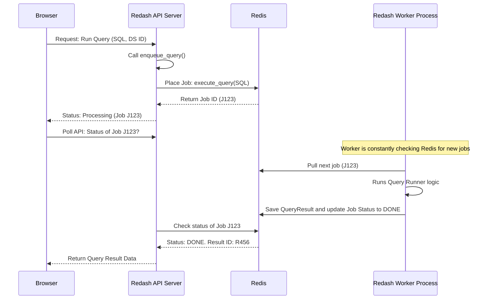

# Chapter 6: RQ (Redis Queue) Tasks

[Previous Chapter: Query Parameters](05_query_parameters_.md)

In [Chapter 5: Query Parameters](05_query_parameters_.md), we learned how to make queries dynamic and interactive. When a user hits "Execute" on a complex query—especially one hitting a large dataset—the process of talking to the [Data Source and Query Runner](03_data_source_and_query_runner_.md) can take seconds, or even many minutes.

If Redash tried to handle these long-running tasks directly within the web server (the part that serves the UI and handles fast API calls), the whole application would freeze for everyone. This is called **blocking**.

To solve this, Redash employs a specialized, highly efficient system for handing off heavy computation: **RQ (Redis Queue) Tasks**.

---

## 1. The Core Problem: Offloading the Heavy Lifting

Imagine Redash as a high-end restaurant.

* The **Web Server** is the waiter: fast, needs to handle many customers instantly, but cannot spend 10 minutes cooking one dish.
* The **RQ System** is the kitchen: processes that are slow and dedicated to cooking.

When a user executes a long query, the waiter (Web Server) does not wait for the food to cook. Instead, they write the order (the query execution job) on a ticket and hand it to the kitchen (the RQ system). The waiter is then free to take other orders, while the query cooks in the background.

The RQ system relies on three main components:

| Component | Role | Analogy | Redash Implementation |
| :--- | :--- | :--- | :--- |
| **Redis** | The central message broker (the ticket board). | Stores the queue of tasks. | Used as the communication hub (`REDASH_REDIS_URL`). |
| **The Queue (RQ)** | The list of pending tickets. | A library that manages jobs in Redis. | Python's `RQ` library. |
| **Workers** | The dedicated cooking processes (chefs). | Python processes constantly pulling jobs from the queue. | Run via `redash/cli/rq.py: worker`. |

## 2. The Architecture: Three Types of Redash Processes

When you run Redash, you typically run three distinct types of Python processes, all managed separately:

1. **Server (Web):** Handles user requests, UI, and API calls. Its job is *only* to take orders and quickly hand off heavy tasks to the queue.
2. **Worker:** Dedicated processes that read jobs from the queue and run them (e.g., `execute_query`). These are the heavy lifters.
3. **Scheduler:** A periodic process that wakes up every minute to check which saved queries need to be refreshed and puts those jobs onto the queue automatically.

The `compose.yaml` file explicitly defines these roles for development:

```yaml
# compose.yaml (Simplified)
services:
  # The fast, responsive part (the waiter)
  server:
    command: dev_server 

  # The chef that automatically runs scheduled queries
  scheduler:
    command: dev_scheduler

  # The chefs that run user-triggered or scheduled queries
  worker:
    command: dev_worker
```

These processes all share access to the same Redis instance to communicate their tasks.

## 3. The Central Use Case: Enqueueing a Query

The most common background task is query execution. When a user requests results, the Redash API calls the `enqueue_query` function.

### 3.1 The `enqueue_query` Function

This function, located in `redash/tasks/queries/execution.py`, is the moment the Web Server hands the ticket to the kitchen.

It ensures that if the *exact same* query (with the same `query_hash`) is already running, it doesn't run it again—it just returns the existing **Job ID**.

```python
# redash/tasks/queries/execution.py (Highly Simplified)
from redash.tasks.worker import Queue

def enqueue_query(query, data_source, user_id, scheduled_query=None, metadata={}):
    query_hash = gen_query_hash(query)
    
    # 1. Check if a job for this query_hash is already running (locking logic omitted)
    existing_job = check_for_existing_job(query_hash, data_source.id)
    
    if existing_job:
        return existing_job # Already running, return its ID
        
    # 2. Determine which queue to use (e.g., 'queries' or 'scheduled_queries')
    queue_name = data_source.queue_name 

    # 3. Create a queue instance and put the task on the board
    queue = Queue(queue_name)
    job = queue.enqueue(
        execute_query, # The function the worker will run
        query, 
        data_source.id, 
        metadata, 
        # ... other parameters like job_timeout ...
    )
    
    # 4. Save the job ID in Redis to prevent duplicates
    set_job_lock(query_hash, data_source.id, job.id) 
    
    return job
```

When this function completes, the Web Server returns the `job.id` to the user's browser. The browser then uses this Job ID to constantly ask the API: "Is my result ready?" (This polling is managed by the frontend `QueryResult` object we saw in [Chapter 4: Query and QueryResult](04_query_and_queryresult_.md)).

### 3.2 Sequence of Events: Asynchronous Execution

Here is the simplified flow when a user clicks 'Execute':



## 4. The Worker Implementation

The Worker process is very simple in its goal: loop forever, grab the next available task from the queue, and execute the corresponding Python function.

Redash uses its own wrapper class, `RedashWorker` (`redash/tasks/worker.py`), which inherits from the base RQ worker. This wrapper adds crucial features like:

1. **Hard Time Limits:** Ensures workers don't get stuck infinitely if a query exceeds the allowed execution time (see `HardLimitingWorker`).
2. **Statsd Metrics:** Tracks how many jobs are running or failing (`StatsdRecordingWorker`).
3. **Cancellable Jobs:** Allows users to cancel a running query via the UI.

The command used to start the workers in Redash is handled by the `redash/cli/rq.py` file:

```python
# redash/cli/rq.py (Simplified)
from redash import rq_redis_connection
from redash.tasks.worker import Worker

@manager.command()
@argument("queues", nargs=-1)
def worker(queues):
    # If no queues are specified, use the default list
    if not queues:
        queues = default_queues 
        
    with Connection(rq_redis_connection):
        # Instantiate the Redash Worker
        w = Worker(queues, log_job_description=False) 
        # Start the endless loop of processing jobs
        w.work() 
```

The `w.work()` call is the core of the worker's life: it connects to Redis and waits for a job to appear in any of the queues it monitors (like `queries` or `scheduled_queries`).

### 4.1 Running the Query Task

When the worker pulls the `execute_query` job, it calls the main execution logic implemented in the `QueryExecutor` class.

```python
# redash/tasks/queries/execution.py (QueryExecutor.run simplified)
class QueryExecutor:
    # ... init loads data_source, query, user ...
    
    def run(self):
        started_at = time.time()
        query_runner = self.data_source.query_runner # Chapter 3
        
        try:
            # Run the query using the specialized runner
            data, error = query_runner.run_query(self.query, self.user)
        except Exception as e:
            # Handle timeout or execution failure
            error = str(e)
            data = None 

        run_time = time.time() - started_at
        
        if error is None:
            # Success! Save the data as a QueryResult (Chapter 4)
            query_result = models.QueryResult.store_result(...)
            
            # Update the parent Query model to point to the new result
            updated_query_ids = models.Query.update_latest_result(query_result)
            
            # Trigger subsequent tasks (like checking alerts)
            check_alerts_for_query.delay(...)
            
            return query_result.id
        else:
            # Failure: record the failure and raise an exception
            raise QueryExecutionError(error)
```

This sequence shows that the Worker is where all the logic from the previous chapters (Query Runners, QueryResults, Alerts) finally meets and executes.

## 5. Other Critical RQ Tasks

Besides `execute_query`, Redash relies on the RQ system for all routine maintenance and background activity:

| Task Function | Description | Scheduler or User? |
| :--- | :--- | :--- |
| `refresh_queries` | Automatically runs all saved queries that have a defined schedule (e.g., every 5 minutes). | Scheduler |
| `refresh_schemas` | Fetches the table and column structure for all Data Sources, so users can browse them. | Scheduler |
| `check_alerts_for_query` | Compares a fresh `QueryResult` against saved alert conditions (e.g., "Alert me if the number of errors > 100"). | Worker |
| `send_mail` | Handles sending email notifications (like password resets or alert triggers). | Worker |

This division of labor ensures that whether Redash is dealing with a user clicking "Execute," or routine maintenance tasks, the main Web Server remains fast and responsive.

## Conclusion

The RQ (Redis Queue) system is the essential workhorse of Redash, enabling performance and reliability. By using Redis as a message broker and separating long-running tasks into dedicated Worker processes, Redash ensures that:

1. **Execution is Asynchronous:** Users never wait for long SQL queries in the browser session.
2. **Scheduling is Automated:** Queries are refreshed reliably in the background by the Scheduler process.
3. **The Application is Responsive:** The Web Server is dedicated only to serving the user interface and API requests.

With the mechanics of query execution now understood, we can finally turn our attention to how Redash takes the raw data results and turns them into beautiful charts and graphs.

[Next Chapter: Visualization Core (viz-lib)](07_visualization_core__viz_lib__.md)

---

<sub><sup>Generated by [AI Codebase Knowledge Builder](https://github.com/The-Pocket/Tutorial-Codebase-Knowledge).</sup></sub> <sub><sup>**References**: [[1]](https://github.com/getredash/redash/blob/bc0add410d61430a1a43a21abf2454a493c0b046/.ci/compose.ci.yaml), [[2]](https://github.com/getredash/redash/blob/bc0add410d61430a1a43a21abf2454a493c0b046/compose.yaml), [[3]](https://github.com/getredash/redash/blob/bc0add410d61430a1a43a21abf2454a493c0b046/redash/__init__.py), [[4]](https://github.com/getredash/redash/blob/bc0add410d61430a1a43a21abf2454a493c0b046/redash/cli/rq.py), [[5]](https://github.com/getredash/redash/blob/bc0add410d61430a1a43a21abf2454a493c0b046/redash/tasks/queries/execution.py), [[6]](https://github.com/getredash/redash/blob/bc0add410d61430a1a43a21abf2454a493c0b046/redash/tasks/worker.py)</sup></sub>
