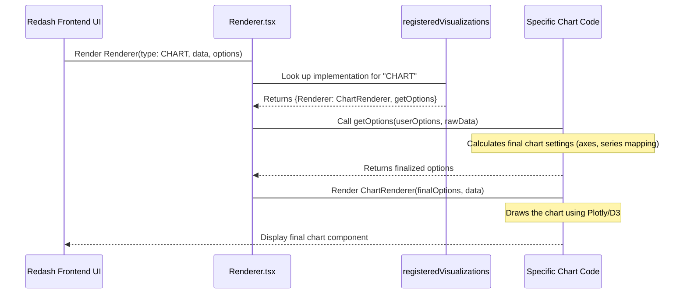

# Chapter 7: Visualization Core (viz-lib)

[Previous Chapter: RQ (Redis Queue) Tasks](06_rq__redis_queue__tasks_.md)

In [Chapter 6: RQ (Redis Queue) Tasks](06_rq__redis_queue__tasks_.md), we learned how Redash efficiently runs heavy queries in the background, eventually producing a successful and structured block of data called the [QueryResult](04_query_and_queryresult.md).

That `QueryResult` is just raw rows and columns (a big JSON object). The final, crucial step is taking that raw data and turning it into something useful and beautiful: a chart, a table, or a counter.

This transformation is handled entirely by a separate, powerful library called the **Visualization Core**, often referred to internally as **`viz-lib`** or `@redash/viz`.

---

## 1. The Core Problem: Displaying Data Flexibly

Imagine you have the following data from a query:

| Month | Sales |
| :--- | :--- |
| Jan | 1000 |
| Feb | 1200 |
| Mar | 800 |

A user might want to see this data in three different ways:

1. **As a Table:** For precise raw values.
2. **As a Line Chart:** To see the trend over time.
3. **As a Counter:** To display only the total sales (3000).

The problem is that the core Redash application doesn't want to house the complex logic needed to draw charts (using libraries like Plotly or D3.js) for every single visualization type.

The solution is `viz-lib`: a dedicated, standalone React library that takes two primary inputs—the raw data and a set of visualization options—and reliably outputs the final rendered component.

## 2. The Two Core Components: Renderer and Editor

The `viz-lib` library provides two main components that define how data is visualized:

| Component | Role | What it Does |
| :--- | :--- | :--- |
| **Renderer** | The Output View | Takes the data and options, and draws the final chart, graph, or table on the screen. |
| **Editor** | The Configuration View | Provides the UI (menus, dropdowns, settings panels) for the user to customize the visualization (e.g., set the X-axis, change the color, hide columns). |

### 2.1 Using the Components

In the Redash frontend code (which uses React), whenever a visualization needs to be displayed, Redash imports and uses these two generic components, specifying the `type` (e.g., `CHART`, `COUNTER`).

```jsx
// Simplified example from Redash frontend
import { Renderer, Editor } from "@redash/viz";

function VisualizationView({ data, visualizationOptions }) {
  // 1. Display the configuration panel for the user to change settings
  <Editor 
    type="CHART" 
    options={visualizationOptions} 
    data={data} 
    onChange={newOptions => save(newOptions)}
  />

  // 2. Display the actual chart using the chosen options
  <Renderer 
    type="CHART" 
    options={visualizationOptions} 
    data={data} 
  />
}
```

The power here is that Redash only needs to worry about saving the `options` object (the settings); the `viz-lib` handles all the complex UI drawing and configuration logic internally.

## 3. The Visualization Settings (`visualizationsSettings`)

Since `viz-lib` is a standalone library, it needs context from the main Redash application environment, such as:

* What is the default date format?
* How should large numbers be formatted?
* What maps are available for Choropleth visualizations?

This context is provided through a global configuration object managed by Redash called `visualizationsSettings`. Redash sets these global rules *before* rendering any visualization.

```typescript
// viz-lib/src/visualizations/visualizationsSettings.tsx (Simplified)
export const visualizationsSettings = {
  // Default values used by all visualizations
  dateFormat: "DD/MM/YYYY",
  dateTimeFormat: "DD/MM/YYYY HH:mm",
  integerFormat: "0,0",
  floatFormat: "0,0.00",
  booleanValues: ["false", "true"],
  
  // Specific settings needed for specialized visualizations
  choroplethAvailableMaps: {}, 
  allowCustomJSVisualizations: false,
  hidePlotlyModeBar: false,
};

// Function used by Redash app code to override defaults
export function updateVisualizationsSettings(options: any) {
  extend(visualizationsSettings, options);
}
```

For instance, if the Redash administrator sets the application date format to "YYYY-MM-DD" in the settings, Redash calls `updateVisualizationsSettings` before initialization. The `Renderer` for the Table visualization will then automatically use "YYYY-MM-DD" when displaying any date column.

## 4. How the Renderer Works Under the Hood

When the `Renderer` component is initialized, it must perform two jobs:

1. Look up the specific code needed for the requested visualization `type` (e.g., `CHART`).
2. Pass the data and options to that specialized component for drawing.

This lookup is handled by a registry.

### 4.1 The Visualization Registry

All visualization types (Chart, Table, Counter) register themselves internally in `viz-lib` by providing their `Renderer` component, their `Editor` component, and a function to calculate options.

For example, the Chart visualization registers itself in `viz-lib/src/visualizations/chart/index.ts`:

```typescript
// viz-lib/src/visualizations/chart/index.ts (Simplified)
import getOptions from "./getOptions";
import Renderer from "./Renderer";
import Editor from "./Editor";

export default {
  type: "CHART",
  name: "Chart",
  isDefault: true,
  getOptions,
  Renderer, // The React component that draws the chart
  Editor,   // The React component that provides settings UI
  // ... size metrics ...
};
```

This registration populates a map called `registeredVisualizations`.

### 4.2 The Renderer Lookup

The main `viz-lib/src/visualizations/Renderer.tsx` component acts as a generic loader:

```typescript
// viz-lib/src/visualizations/Renderer.tsx (Simplified)
import registeredVisualizations from "@/visualizations/registeredVisualizations";

export default function Renderer({ type, data, options: optionsProp, ...otherProps }: Props) {
  
  // 1. Look up the specific implementation using the 'type' string
  const { Renderer, getOptions } = registeredVisualizations[type];

  // 2. Normalize and compute the final options before passing them down
  let options = getOptions(optionsProp, data);

  return (
    <ErrorBoundary>
      <div className="visualization-renderer-wrapper">
        {/* 3. Render the specific visualization component */}
        <Renderer options={options} data={data} {...otherProps} />
      </div>
    </ErrorBoundary>
  );
}
```

This generic `Renderer` component ensures that whether you are drawing a map or a pivot table, the wrapping structure (like the `ErrorBoundary` for error handling) and the flow of data/options are always consistent.

## 5. Sequence of Events: Displaying a Chart

Let's trace the flow from the moment the user has a finalized [QueryResult](04_query_and_queryresult.md) and selects the Chart visualization type.



## Conclusion

The Visualization Core (`viz-lib`) is a critical abstraction layer that decouples the complexity of data charting from the core Redash application.

* It acts as a library containing generic wrappers: the **`Renderer`** (to display the chart) and the **`Editor`** (to configure the chart).
* It relies on a registry system to load the correct specialized components based on the visualization `type`.
* It uses `visualizationsSettings` to ensure consistency in formatting and features across all visualization types within the Redash environment.

With visualizations understood, we have now covered the entire life cycle of data in Redash, from user input and authentication, through data connection and asynchronous execution, to the final display. This concludes our exploration of the core Redash architecture.

---

<sub><sup>Generated by [AI Codebase Knowledge Builder](https://github.com/The-Pocket/Tutorial-Codebase-Knowledge).</sup></sub> <sub><sup>**References**: [[1]](https://github.com/getredash/redash/blob/bc0add410d61430a1a43a21abf2454a493c0b046/viz-lib/README.md), [[2]](https://github.com/getredash/redash/blob/bc0add410d61430a1a43a21abf2454a493c0b046/viz-lib/src/index.ts), [[3]](https://github.com/getredash/redash/blob/bc0add410d61430a1a43a21abf2454a493c0b046/viz-lib/src/visualizations/Renderer.tsx), [[4]](https://github.com/getredash/redash/blob/bc0add410d61430a1a43a21abf2454a493c0b046/viz-lib/src/visualizations/chart/index.ts), [[5]](https://github.com/getredash/redash/blob/bc0add410d61430a1a43a21abf2454a493c0b046/viz-lib/src/visualizations/visualizationsSettings.tsx)</sup></sub>
