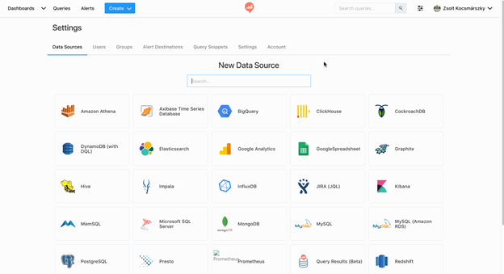
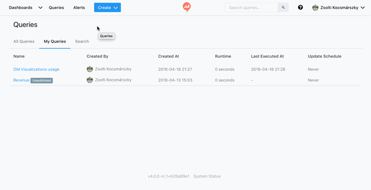
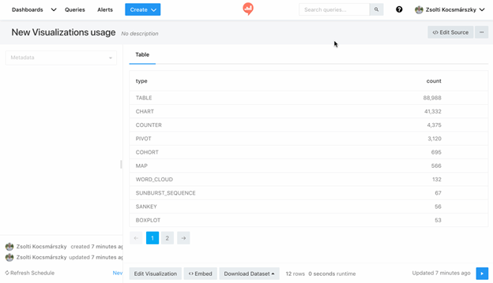
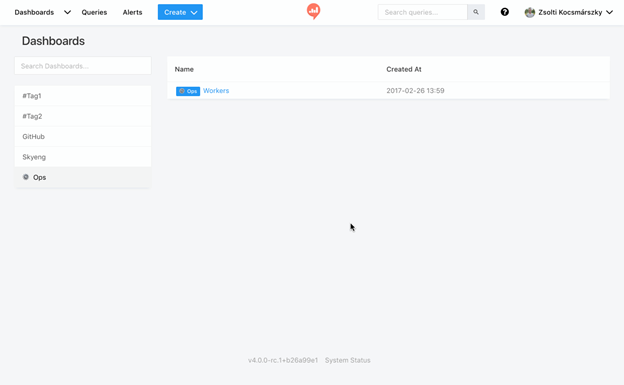

### Summary of Redash Platform

**Redash** is a data visualization and querying tool designed to simplify data access, analysis, and sharing within organizations. It enables users to connect to multiple data sources, write and execute queries, build interactive dashboards, and collaborate effectively on data insights.

---

### Key Features and Capabilities

- **Connect and Query Multiple Data Sources:**  
  Redash supports a wide range of data sources including SQL, NoSQL, Big Data platforms, and APIs. This flexibility allows users to perform complex queries across diverse datasets without switching tools.

- **Powerful Online SQL Editor:**  
  Users benefit from a cloud-based SQL client that combines power with ease of use, featuring:  
  - Schema browsing with click-to-insert functionality  
  - Query snippets for reuse and efficiency  
  - Collaborative query writing capabilities

- **Data Visualization on Dashboards:**  
  Redash provides an intuitive drag-and-drop interface for creating customizable dashboards. Features include:  
  - Resizable visualizations for tailored data views  
  - Scheduled refreshes to keep data current  
  - Easy sharing options for internal teams or public audiences

- **Additional Functionalities:**  
  - **API Access:** Enables integration and automation possibilities  
  - **Alerts:** Set notifications based on query results or thresholds  
  - **User Management:** Administer permissions and roles to control access

- **Open Source Nature:**  
  Redash is an open-source project, providing:  
  - Full customization and feature extension capabilities  
  - No vendor lock-in, promoting flexibility and community contribution

---

### User Endorsement

Ben Dehghan, Co-Founder of Data Miner, emphasizes Redash’s essential role in his company, highlighting its ease of adoption and critical function in accessing data efficiently:  
> _“Redash is as essential as email to my company. We love data but accessing the data is a pain without Redash. Any company I go to, I get them hooked on Redash. It’s an easy sell :)"_

---

### Supported Data Sources and Integrations

| Data Source Types | Description                          |
|-------------------|------------------------------------|
| SQL               | Traditional relational databases   |
| NoSQL             | Non-relational databases            |
| Big Data          | Large-scale data platforms          |
| API               | External services and custom data  |

_For a detailed list of supported integrations, users are directed to Redash’s integrations page._

---

### Summary of Benefits

- **Centralized Data Access:** Query all needed data from a single platform regardless of source type.  
- **Enhanced Collaboration:** Cloud-based environment promotes sharing and teamwork.  
- **User-Friendly Visualizations:** Drag-and-drop and scheduling improve data comprehension and timeliness.  
- **Customization and Control:** Open-source license encourages flexibility and no vendor lock-in.  
- **Scalability:** Supports diverse data environments, from traditional databases to modern Big Data systems.

---

### Summary of Redash User Guide: Getting Started

This guide provides a step-by-step overview of the fundamental processes for using Redash, a data visualization and collaboration platform. It covers connecting data sources, querying data, creating visualizations and dashboards, and inviting team members to collaborate.

---

### Key Steps and Features

#### 1. Add a Data Source

- Begin by connecting a data source through the **Data Sources management page** accessible via the Settings icon.
- It is **recommended to use a user with read-only permissions** to enhance security.
- Supported data sources are linked for reference (_details not included_).
- 

#### 2. Write a Query

- After connecting a data source, create a query by selecting **“Create”** in the navigation bar and then choosing **“Query”**.
- Detailed instructions on writing queries are available in the linked “Writing Queries” documentation.
- Queries return data that can be viewed as tables by default.
- 

#### 3. Add Visualizations

- Query results initially appear in a simple table.
- To better interpret complex data, Redash offers **multiple visualization types**.
- Create visualizations by clicking the **“New Visualization”** button above query results.
- More detailed guidance on visualization options is provided in the referenced documentation.
- 

#### 4. Create a Dashboard

- Dashboards allow combining visualizations and text for thematic presentations.
- Create a new dashboard via **“Create” > “Dashboard”** in the navigation bar.
- Dashboards can be shared with team members or made public.
- Further details on dashboard editing are linked in the guide.
- 

#### 5. Invite Colleagues

- Collaboration is a core feature of Redash.
- Only **admins can invite new users** by navigating to `Settings > Users > New User`.
- Invitations require entering the new user’s name and email; the user receives an email to set up their Redash account.
- Users can be added to groups via `Settings > Groups`.
- Collaborators can view, fork, and create queries and dashboards, and share insights through Email, Slack, Mattermost, or HipChat.

---

### Important Technical Details and Recommendations

| Aspect                      | Details                                   |
|-----------------------------|-------------------------------------------|
| Recommended Data Source Access | Use read-only permissions where possible |
| Admin User Invitation        | Only admins can invite users               |
| Collaboration Features       | Query sharing, dashboard sharing, forking, integration with messaging platforms |

---

### **Key Insights**

- **Security best practice:** Use read-only database users and configure firewall rules to allow Redash access.
- **Collaboration:** Redash enhances teamwork by allowing users to share, fork, and build upon each other’s queries and dashboards.
- **Visualization flexibility:** Multiple visualization options help users interpret query results beyond simple tables.
- **User management:** Admin-controlled invitations and group management streamline user access and permissions.
- **Dashboard capability:** Combining multiple visualizations and text enables powerful thematic storytelling with data.

---

### _Uncertain / Not Specified_

- Specific supported data sources beyond the link reference.
- Detailed query-writing syntax or examples.
- Exact visualization types supported.
- Limits on number of users or dashboards.

---

This structured sequence and feature overview provide a foundational understanding for new Redash users to effectively connect data, query, visualize, and collaborate within the platform.
---

### Core Conclusion

**Redash is a versatile, collaborative, and open-source data platform that empowers organizations to unify their data querying and visualization workflows. ** Its combination of multi-source connectivity, powerful SQL editing, dashboarding, and community-driven development makes it a critical tool for businesses aiming to leverage data effectively.
