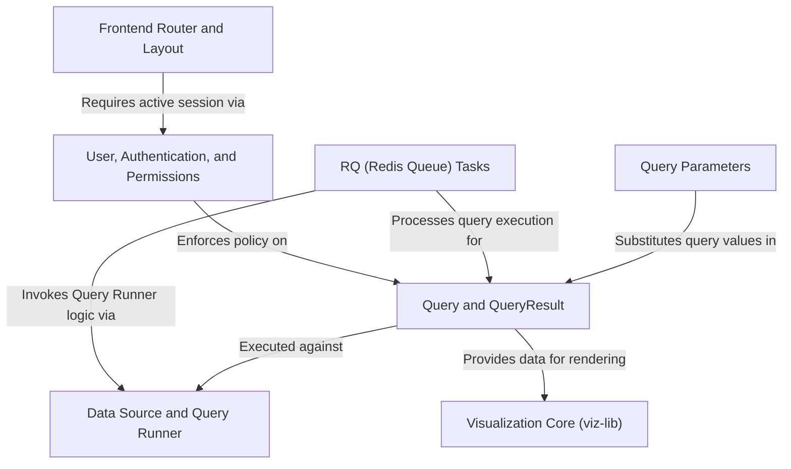

# Tutorial: redash

Redash is a platform for *data collaboration and visualization*. It allows users to write **SQL queries** against various external databases configured as *Data Sources*. Query processing is handled asynchronously using **RQ background tasks**, which then produce immutable *Query Results*. These results are ultimately displayed using the **Visualization Core**, often incorporating **dynamic parameters** for interactivity, all secured by granular user permissions and authentication checks.

## Visual Overview

## Chapters

1. [Frontend Router and Layout
](01_frontend_router_and_layout_.md)
2. [User, Authentication, and Permissions
](02_user__authentication__and_permissions_.md)
3. [Data Source and Query Runner
](03_data_source_and_query_runner_.md)
4. [Query and QueryResult
](04_query_and_queryresult_.md)
5. [Query Parameters
](05_query_parameters_.md)
6. [RQ (Redis Queue) Tasks
](06_rq__redis_queue__tasks_.md)
7. [Visualization Core (viz-lib)
](07_visualization_core__viz_lib__.md)

---

Generated by [AI Codebase Knowledge Builder](https://github.com/The-Pocket/Tutorial-Codebase-Knowledge).
